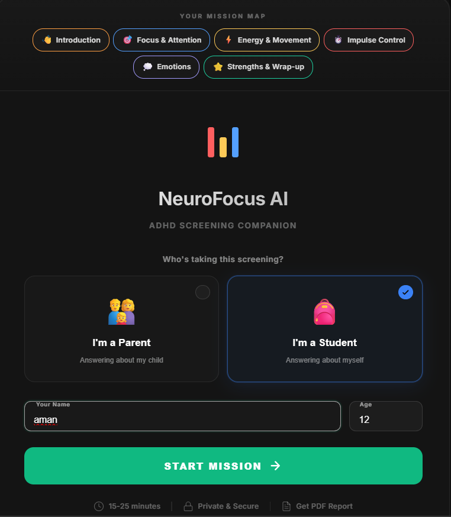
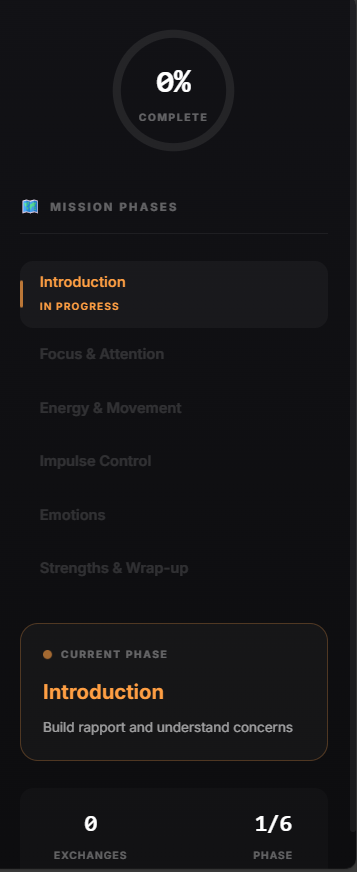
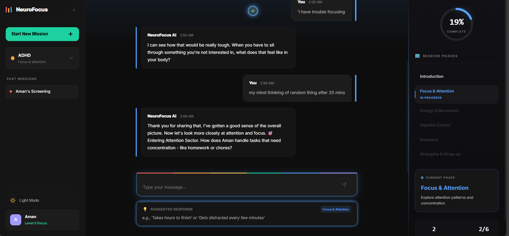
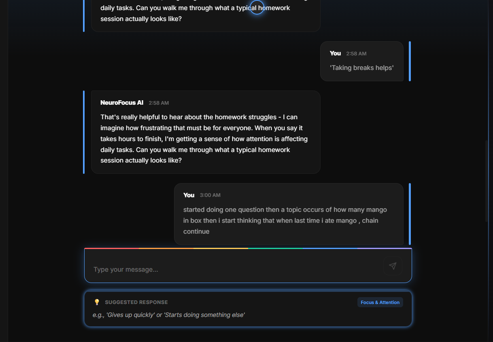
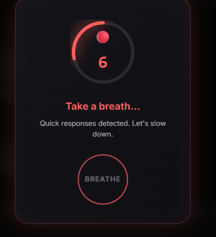
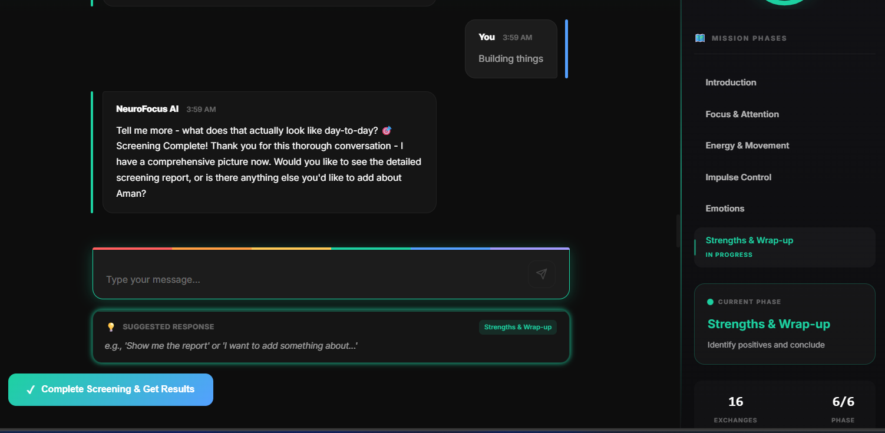
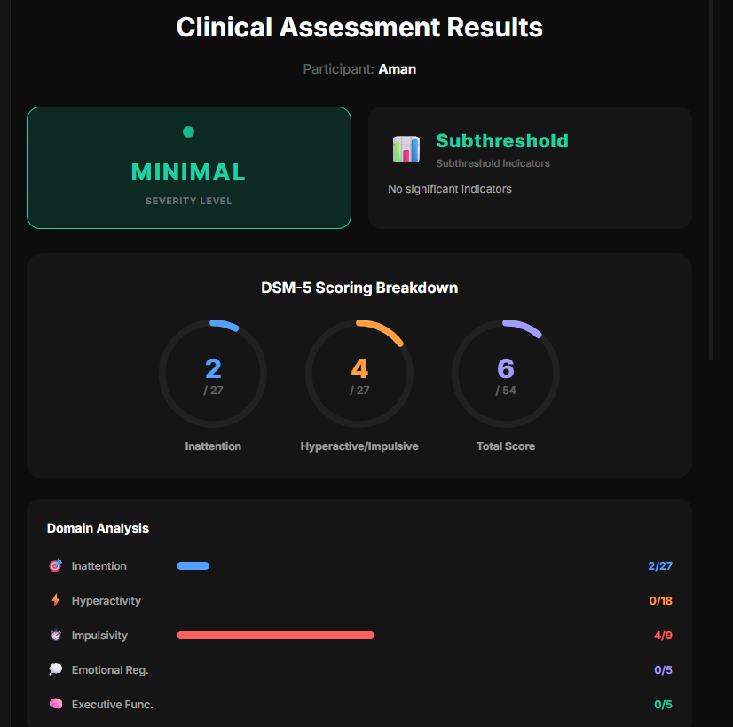

# 👥 NeuroNav User Guide

Quick guide to using NeuroNav for ADHD screening.

---

## What is NeuroNav?

NeuroNav is an **AI-powered ADHD screening tool** for children aged 6-17. It uses natural conversation to assess attention, hyperactivity, and impulsivity patterns.

**Who Can Use It:**
- 👨‍👩‍👧 **Parents** - Answer about your child
- 👨‍🏫 **Teachers** - Share classroom observations  
- 🧑 **Teens (13-17)** - Self-assessment

---

## Features

### 🎮 Interactive Experience
- **Mission-Based Journey** - 6 sectors (phases) as space exploration
- **Color-Coded** - Each phase has unique colors (Orange → Blue → Yellow → Red → Purple → Green)
- **Beautiful Visuals** - Animated stars, progress map, real-time feedback
- **Smart Pacing** - Cool-down timers, engagement monitoring, Zen mode

### 📊 Results & Reports
- **Visual Results** - Color-coded severity levels and domain scores
- **PDF Report** - Professional report with transcript, scores, recommendations
- **5 ADHD Domains** - Inattention, Hyperactivity, Impulsivity, Emotional, Executive Function

---

## How to Use the App

### Step 1: Setup (2 min)
1. Open NeuroNav in browser
2. Enter: Child's name, age (6-17), your role (Parent/Teacher/Self)
3. Click "Launch Mission"

### Step 2: Complete 6 Sectors (15-25 min)

| Sector | Focus | Duration |
|--------|-------|----------|
| 👋 **Alpha** (Orange) | Introduction, initial concerns | 2-3 questions |
| 🎯 **Beta** (Blue) | Focus & attention patterns | 3-5 questions |
| ⚡ **Gamma** (Yellow) | Energy & hyperactivity | 3-5 questions |
| ⏱️ **Delta** (Red) | Impulse control | 2-4 questions |
| 💭 **Epsilon** (Purple) | Emotional regulation | 2-4 questions |
| ⭐ **Omega** (Green) | Strengths & wrap-up | 2-3 questions |

**How to Answer:**
- Type naturally and specifically
- Use hints as examples
- Give real-life examples with details
- Take your time (quality over speed)

### Step 3: Review Results (5 min)
1. View results screen with domain scores
2. Read severity levels and what they mean
3. Download PDF report
4. Share with healthcare provider

---

## Answering Tips

### ✅ DO:
- **Be Specific**: "Can't sit through 5-minute meals" not "He's active"
- **Use Examples**: "Loses homework 3x/week" not "Forgets things"
- **Think Long-Term**: Patterns over 6+ months, not just today
- **Compare to Peers**: How does behavior compare to same-age kids?
- **Be Honest**: No judgment - honesty helps your child

### ❌ DON'T:
- Rush through questions
- Give vague one-word answers
- Focus on isolated incidents
- Try to guess "right" answers

---

## Understanding Results

### Severity Levels

| Level | What It Means |
|-------|---------------|
| 🟢 **Minimal** | Few or no significant indicators detected (totalScore < 15) |
| 🟠 **Mild** | Notable patterns present; monitoring recommended (totalScore ≥ 15) |
| 🟠 **Moderate** | Significant patterns; professional evaluation advised (totalScore ≥ 28) |
| 🔴 **Severe** | Multiple strong indicators; comprehensive evaluation recommended (totalScore ≥ 42) |

### The 5 Domains

**🎯 Inattention** - Focus problems, task completion, organization, forgetfulness

**⚡ Hyperactivity** - Excessive movement, fidgeting, can't stay seated, restlessness

**⏱️ Impulsivity** - Acting without thinking, interrupting, difficulty waiting

**💭 Emotional** - Frustration tolerance, mood swings, emotional reactions

**🧠 Executive Function** - Planning, time management, task initiation, working memory

### Age-Based Scoring
- **Ages 6-16:** Need 6+ symptoms for clinical significance
- **Ages 17+:** Need 5+ symptoms for clinical significance

---

## Example Answers by Sector

### 🎯 Focus & Attention
- ❌ Vague: "Struggles with homework"
- ✅ Specific: "Takes 3 hours for 30-min homework, gets up every 5 minutes"

### ⚡ Energy & Movement
- ❌ Vague: "Not really sits still"
- ✅ Specific: "Up 5+ times per meal, fidgets constantly even while chewing"

### ⏱️ Impulse Control
- ❌ Vague: "Sometimes interrupts"
- ✅ Specific: "Interrupts every conversation, can't wait 10 seconds before blurting"

### 💭 Emotions
- ❌ Vague: "Gets upset"
- ✅ Specific: "Cries for 20+ minutes over small things, throws items when frustrated"

---

## Important Information

### ⚠️ This is a Screening Tool, NOT a Diagnosis

**What NeuroNav IS:**
- ✅ Structured screening questionnaire
- ✅ Pattern identification tool
- ✅ Report to share with doctors
- ✅ Conversation starter

**What NeuroNav is NOT:**
- ❌ Medical diagnosis
- ❌ Replacement for professional evaluation
- ❌ Sufficient for treatment decisions

### Next Steps
1. Download and review PDF report
2. Schedule appointment with pediatrician or psychologist
3. Share report with healthcare provider
4. Request comprehensive evaluation if concerns present
5. Remember: Only licensed professionals diagnose ADHD

---

## Quick Tips by User Type

### Parents
✓ Observe patterns over 6+ months  
✓ Compare to same-age children  
✓ Consider multiple settings (home, school, social)  
✓ Ask teachers for input too  
✓ Bring PDF to doctor appointments

### Teachers
✓ Think about full school year behavior  
✓ Compare to grade-level peers  
✓ Note academic impact  
✓ Coordinate with parents

### Teens (Self-Assessment)
✓ Be honest with yourself  
✓ Think about multiple life areas  
✓ Ask trusted adults for perspective  
✓ Remember: ADHD is manageable with support

---

## During the Assessment

**Available Features:**
- 🧘 **Zen Mode** - Reduce visuals if distracting
- 📊 **Pattern Toasts** - See detected patterns in real-time
- ⏰ **Cool-Down Timer** - Prevents rushing
- 🗺️ **Mission Map** - Track progress visually
- 💡 **Hints** - Example answers below each question
- 📈 **Focus Meter** - Real-time engagement feedback

---

## FAQ

**Q: How long does it take?**  
A: 15-25 minutes. Take your time for accuracy.

**Q: Can I save and return later?**  
A: Currently, complete in one session.

**Q: Should my child be present?**  
A: For parent/teacher - no. For teen self-assessment - yes.

**Q: Results show high scores - what now?**  
A: Download PDF and schedule appointment with healthcare provider.

**Q: Are results accurate?**  
A: Uses DSM-5 criteria, but only professionals can diagnose.

---

## Privacy & Support

**Privacy:**
- 🔒 Secure session storage
- 🔒 Confidential data
- 🔒 Reports only accessible to you

**Support:**
- Developer: [@Asmit-ctrl](https://github.com/Asmit-ctrl)
- For technical issues: Open GitHub issue

---

**Remember:** You're taking an important step in understanding and supporting your child. Share your PDF report with your pediatrician or psychologist. 💙

---

**For technical details, see [DEVELOPER_GUIDE.md](./DEVELOPER_GUIDE.md)**
